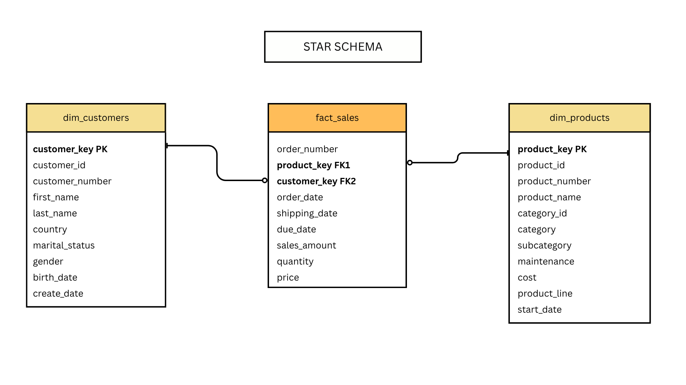
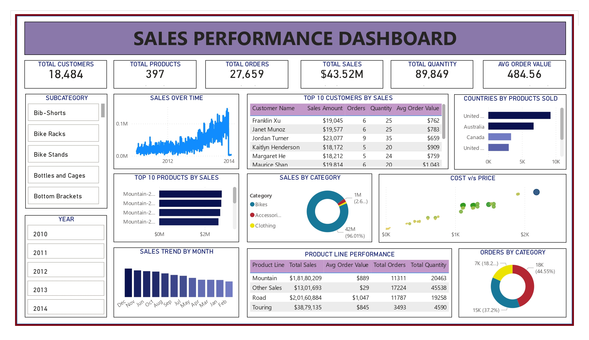

# 🧠 Advanced Data Analytics

This project delivers a full-stack **data analytics solution** using SQL to perform **Exploratory Data Analysis (EDA)**, **Advanced Trend & KPI Analysis**, and **Insightful Reporting** on a sales dataset.

It is structured for modular development, enabling seamless database initialization, analytical processing, and report generation using clean SQL workflows.

---
## 🔗 Project Continuation

This project is a continuation of **[Data-Warehousing](https://github.com/devikarajesht45-prog/Data-Warehousing)**.

The previous project focused on building the foundation of the analytical environment, including:

- 🏗️ **Data Architecture** – Bronze, Silver, and Gold layers
- 🔄 **ETL Pipelines** – Extraction, transformation, cleansing, and loading
- 🧹 **Data Quality & Transformation** – Cleaning and standardization of CRM and ERP data
- ⭐ **Data Modeling** – Gold-layer star schema with fact and dimension tables
- 🗄️ **SQL Server Data Warehouse** – Business-ready analytical data

This project builds on that foundation by focusing on the **Analytics & Business Intelligence layer**.

---
## 📦 Dataset Overview

The dataset is structured into a **star schema**:


- `gold.dim_customers.csv` – Customer details (demographics, IDs)
- `gold.dim_products.csv` – Product details (categories, pricing)
- `gold.fact_sales.csv` – Sales transactions (orders, dates, revenue)

---

## ⚙️ Setup Instructions

> Ensure you are running these in **SQL Server** or a compatible T-SQL engine.

### Initialize Database

Run `init_database.sql` to:
- Create the `DataAnalytics` database and `gold` schema
- Define and populate tables (`dim_customers`, `dim_products`, `fact_sales`) from a `DataWarehouse` source

```sql
data_analytics_database_init.sql
```
---
### 🔍 Exploratory Data Analysis (EDA)

Run: `Analysis/exploratory_data_analysis.sql`
This file aggregates all base-level analysis scripts under one file.

---

### 📈 Advanced Analytics
Run: `Analysis/advanced_data_analytics.sql`
Includes in-depth business performance breakdowns.

---

## 📋 Reports


### 🧑 Customer Report (customer_report.sql)
Creates the view: gold.report_customers

Metrics & KPIs:

- Age, age group, customer segment (VIP, Regular, New)

- Total orders, sales, quantity, lifespan, recency

- Avg. order value and monthly spend

---

### 📦 Product Report (product_report.sql)
Creates the view: gold.report_products

Metrics & KPIs:

- Category, subcategory, segment (High/Mid/Low performer)

- Total orders, quantity, customers

- Avg. selling price, avg. order revenue, monthly revenue

---

## 🎯 Business Insights Enabled

✔️ Track customer and product performance over time  
✔️ Identify high-value customers and products  
✔️ Segment customers by behaviour and value  
✔️ Detect seasonal sales patterns  
✔️ Benchmark performance against historical trends

---
## 📊 Power BI Dashboard

The SQL-based analytics outputs are visualized through an interactive **Power BI dashboard**, providing a consolidated view of sales, customer, and product performance.

### ⭐ Dashboard Highlights

- 📈 Sales and revenue trends over time
- 🛍️ Product and category performance
- 👥 Customer analysis and segmentation
- 💰 Sales, quantity, and average order value KPIs
- 🏆 Top-performing products and customers
- 🚚 Order and shipping performance
- 🔎 Interactive filtering using slicers

### Dashboard Preview




### 🧩 Key Dashboard Components
The dashboard provides an executive-level overview of:

- **Total Customers**
- **Total Products**
- **Total Orders**
- **Total Sales**
- **Average Order Value**
- **Total Quantity**

### 📉 Dashboard Analysis

| Analysis Area | Dashboard Visuals |
|---|---|
| Sales Performance | Sales Over Time, Sales Trend by Month |
| Category Analysis | Sales by Category, Orders by Category |
| Product Analysis | Top 10 Products by Sales, Product Line Performance |
| Customer Analysis | Top 10 Customers by Sales |
| Geographic Analysis| Countries by Products Sold |
| Customer Demographics | Customer Age & Demographics |
| Cost & Pricing | Cost vs Price Analysis |
| Interactive Filtering | Subcategory, Year |

### 💡 Business Questions Answered

The dashboard enables analysis of questions such as:

- Which products generate the highest sales?
- Which product categories contribute the most revenue?
- How are sales changing over time?
- Which countries generate the most sales?
- Which customers generate the highest revenue?
- How does product cost relate to selling price?
- Which product lines have the highest order volume?
  
---
## Repository Structure
```
.Data-Analysis-Reporting
├── Analysis/
│   ├── advanced_data_analytics.sql
│   └── exploratory_data_analysis.sql
│   
├── Dataset/
│   ├── gold.dim_customers.csv
│   ├── gold.dim_products.csv
│   └── gold.fact_sales.csv
│
├── Docs/
│   ├── Sales_Data_Analysis_Dashboard.jpg
│   └── star_schema.png
│
├── Report/
│   ├── customer_report.sql
│   └── product_report.sql
│ 
├── data_analytics_database_init.sql
└── README.md
```


